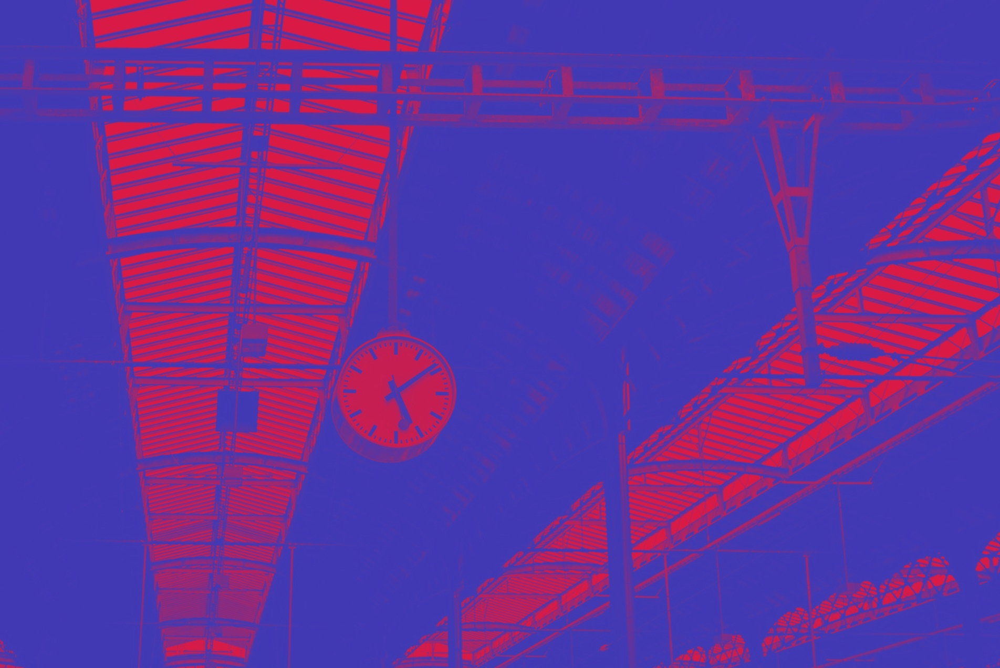

# React Image Filter

Lightweight React component, for applying color filters on images,
works in all modern browsers plus IE10+ and Edge.
Made because CSS filters don't work in IE and Edge :(

Component is written as ES module, so it will work with webpack and other module bundlers (which is standard for React apps anyway). Tested with `react-create-app` and my boilerplate, [Marvin](https://github.com/workco/marvin).


## Demo

Check the [interactive demo](https://stanko.github.io/react-image-filter/).

[](https://stanko.github.io/react-image-filter/)

## Quick start

Get it from [npm](https://www.npmjs.com/package/react-image-filter)

```
$ npm install --save react-image-filter
```

Import and use it in your React app.

```javascript
import React, { Component } from 'react';
import ImageFilter from 'react-image-filter';

class Example extends Component {
  render() {
    return (
      <ImageFilter
        image='https://source.unsplash.com/random/1200x800'
        filter={ 'duotone' } // see docs beneath
        colorOne={ [40, 250, 250] }
        colorTwo={ [250, 150, 30] }
      />
    );
  }
}
```

## Table of contents

* [Props](#user-content-props)
* [Browser support](#user-content-browser-support)
* [License](#user-content-license)

## Props

* **image** string, *required*

  Your image (URL or base64 encoded)

* **filter** string or array, *required*

  Color filter to be applied, passed to [feColorMatrix](https://developer.mozilla.org/en-US/docs/Web/SVG/Element/feColorMatrix).

  This is array of 20 numbers, example:

  ```javascript
  [
    0.3, 0.45, 0.1, 0, 0,
    0.2, 0.45, 0.1, 0, 0,
    0.1, 0.3, 0.1, 0, 0,
    0, 0, 0, 1, 0,
  ];
  ```

  Following presets are available (strings):

  * `duotone` - if you selected duotone, you have to pass `colorOne` and `colorTwo` as well, check beneath
  * `invert`
  * `grayscale`
  * `sepia`

  If you have ideas for new presets, please open an issue titled `Preset: <name of your preset>`, so I can add it. Cheers!

* **colorOne** array

  The first color for duotone filter, array of three numbers which are RED / GREEN / BLUE color values, example:

  ```javascript
  [40, 50, 200]
  ```

* **colorTwo** array

  The second color for duotone filter. Same as `colorOne`.

* **preserveAspectRatio** string, default: 'none', *required*

  Aspect ratio string, passed to image's [preserveAspectRatio](	https://developer.mozilla.org/en-US/docs/Web/SVG/Attribute/preserveAspectRatio).

  You can pass string `cover` to apply the same effect as CSS `background-size: cover`.


* **className** string

  CSS class name (it will be applied along with `ImageFilter` class name).

* **style** object

  CSS style to be applied on wrapper div. Please note that this will override style applied in component.

* **svgStyle** object

  CSS style to be applied on the SVG element. Please note that this will override style applied in component.

* **svgProps** object

  Other props to be passed to SVG, example:

  ```javascript
  {
    'aria-label': 'My awesome image',
    tabIndex: -1,
  }
  ```

* **onChange** function

  Callback to be called on filter change.


## Browser support

Modern browsers and IE10+.

## License

Released under [MIT License](LICENSE.md).
